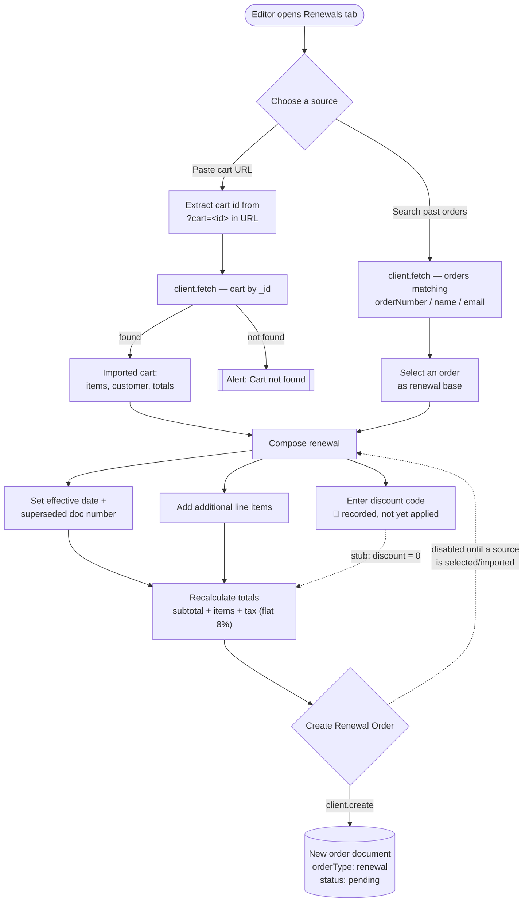

# Sanity Renewals Authorization

A renewal-order management tool for subscription / licensing businesses running on
**Sanity Studio v3 through v6**. It adds a **Renewals** tab to the Studio where an editor can
assemble a renewal order from an existing cart or a past order — set an effective
date, record the superseded document, add line items, and write a new `order`
document with `orderType: 'renewal'`.

> **Status:** Internal package in the Liiift Sanity-tools monorepo. **Not published
> to npm** — the name `sanity-renewals-authorization` is unscoped and unclaimed on the
> registry, so `npm install sanity-renewals-authorization` returns a 404. Consume it by
> path or workspace instead (see [Installation](#installation)). Version `1.0.0`.
> Some advertised features are scaffolded but not yet implemented — see
> [Implementation status](#implementation-status).

  

---

## What it does (renewal authorization flow)

The tool reads existing commerce documents, lets the editor compose a renewal, and
authorizes it by creating a new renewal `order` document through the Sanity client.



---

## Features

| | Feature | Status |
|---|---|---|
| 🔄 | **Cart lookup & import** — import a cart by checkout URL (`?cart=<id>`) | ✅ Implemented |
| 🔍 | **Order search** — find past orders by order number, customer name, or email | ✅ Implemented |
| 📋 | **Interactive renewal form** — effective date, superseded document, line items | ✅ Implemented |
| 📊 | **Order summary sidebar** — live preview of source, customer, and totals | ✅ Implemented |
| ➕ | **Additional line items** — add custom charges, fees, or services | ✅ Implemented |
| 📄 | **Document supersession** — record the document number being renewed | ✅ Implemented |
| ✍️ | **Create renewal order** — writes an `order` document via `client.create()` | ✅ Implemented |
| 💰 | **Pricing / tax** — totals recalculate live | ⚠️ Tax is a fixed 8%; currency hardcoded USD |
| 🎫 | **Discount codes** — capture a discount code on the order | ⚠️ Captured but **not applied** to totals (stub) |
| 🔗 | **Generate cart URL** — shareable renewal checkout link | 🚧 Not implemented (placeholder button) |

See [Implementation status](#implementation-status) for the precise state of the
partial items before relying on them.

---

## Installation

This package is **internal and unpublished**. There is no registry entry — `npm install
sanity-renewals-authorization` will 404, and the name is unscoped, so it is not hiding
under `@overpunch/` either. Consume it from source by one of these routes.

**1. Local path (most common).** Inside the monorepo the package already sits at
`tools/sanity-tools/sanity-renewals-authorization`. From a Studio elsewhere on the same
machine, point at the checkout — npm creates a symlink, so edits are picked up
immediately:

```bash
npm install file:../../tools/sanity-tools/sanity-renewals-authorization
```

**2. npm workspace.** If the consuming Studio and this package live in the same npm
workspace tree, declare it and let the workspace resolver link it:

```jsonc
// package.json of the consuming Studio
"dependencies": {
  "sanity-renewals-authorization": "*"
}
```

**3. Git URL.** Works only if you have read access to the private repository:

```bash
npm install github:Liiift-Studio/sanity-renewals-authorization
```

Either way the import specifier stays `sanity-renewals-authorization`, matching the
`name` in `package.json`.

> `prepare` runs `rollup -c`, so `dist/` is built when the package is installed or linked.
> The `groq` package is a direct dependency and comes along automatically.

Peer dependencies (must already be present in the host Studio) — see
[Studio compatibility](#studio-compatibility) for why these ranges are what they are:

```jsonc
"react":      "^18.0.0 || ^19.0.0",
"sanity":     ">=3 <7",
"@sanity/ui": ">=2 <5"
```

---

## Quick Start

`Renewals()` returns a Sanity **Tool** object (`{ name, title, icon, component }`),
so register it in the `tools` array of your Studio config — it takes **no
arguments**.

```javascript
// sanity.config.js
import { defineConfig } from 'sanity'
import { Renewals } from 'sanity-renewals-authorization'
// `RenewalsAuthorization` is the same function under its full name.

export default defineConfig({
  // ...projectId, dataset, schema, plugins
  tools: [
    Renewals(),
  ],
})
```

The component reads/writes Sanity documents through the Studio's own
`useClient()` — there is **no separate configuration, environment variables, or
options object** to set. Project ID and dataset come from your `defineConfig`.

---

## Usage

### Basic renewal workflow

1. **Open the Renewals tab** in Sanity Studio.
2. **Set renewal information** — effective date (optional) and superseded document number.
3. **Choose a source:**
   - Paste a cart URL from an existing checkout, **or**
   - Search past orders and select one as the renewal base.
4. **Add additional line items** — extra charges or services.
5. **Enter a discount code** (recorded on the order; see status note below).
6. **Create the renewal order** — writes a new `order` document.

### Cart URL import

The importer extracts the cart id from the `cart` query parameter:

```text
https://yourdomain.com/checkout/licenseeInfo?cart=<cart-id>
```

The id is then used to fetch a `cart` document by `_id`.

### Order search

Search past orders by:

- Order number: `#12345`
- Customer name: `John Smith`
- Email address: `customer@example.com`

Matching is a prefix `match` across `orderNumber`, `customer->firstName`,
`customer->lastName`, and `customer->email`, returning the 10 most recent.

---

## Schema Requirements

The tool expects `order` and `cart` document types with the fields below. Adapt
these to your existing commerce schema.

### Order schema

```javascript
export default {
  name: 'order',
  type: 'document',
  fields: [
    // ... existing fields
    {
      title: 'Order Type',
      name: 'orderType',
      type: 'string',
      options: {
        list: [
          { title: 'Regular Order', value: 'regular' },
          { title: 'Renewal Order', value: 'renewal' }
        ]
      },
      initialValue: 'regular'
    },
    {
      title: 'Original Order Reference',
      name: 'originalOrderRef',
      type: 'reference',
      to: [{ type: 'order' }],
      hidden: ({ parent }) => parent?.orderType !== 'renewal'
    },
    {
      title: 'Renewal Information',
      name: 'renewalInfo',
      type: 'object',
      hidden: ({ parent }) => parent?.orderType !== 'renewal',
      fields: [
        {
          title: 'Effective Date',
          name: 'effectiveDate',
          type: 'date'
        },
        {
          title: 'Superseded Document Number',
          name: 'supersededDocNumber',
          type: 'string'
        }
      ]
    },
    {
      title: 'Additional Line Items',
      name: 'additionalLineItems',
      type: 'array',
      of: [{
        type: 'object',
        fields: [
          {
            title: 'Title',
            name: 'title',
            type: 'string',
            validation: Rule => Rule.required()
          },
          {
            title: 'Description',
            name: 'description',
            type: 'text'
          },
          {
            title: 'Quantity',
            name: 'quantity',
            type: 'number',
            initialValue: 1
          },
          {
            title: 'Price (USD)',
            name: 'price',
            type: 'number'
          }
        ]
      }]
    }
  ]
}
```

The created renewal order also writes `customer`, `pricing`, `status: 'pending'`,
`paymentStatus: 'pending'`, `fulfillmentStatus: 'not_fulfilled'`, and (when set)
`discountCode` and `originalOrderRef`.

### Cart schema

```javascript
export default {
  name: 'cart',
  type: 'document',
  fields: [
    // ... existing fields
    {
      title: 'Renewal Information',
      name: 'renewalInfo',
      type: 'object',
      fields: [
        {
          title: 'Effective Date',
          name: 'effectiveDate',
          type: 'date'
        },
        {
          title: 'Superseded Document Number',
          name: 'supersededDocNumber',
          type: 'string'
        }
      ]
    },
    {
      title: 'Additional Line Items',
      name: 'additionalLineItems',
      type: 'array',
      of: [{
        type: 'object',
        fields: [
          { title: 'Title', name: 'title', type: 'string' },
          { title: 'Description', name: 'description', type: 'text' },
          { title: 'Quantity', name: 'quantity', type: 'number' },
          { title: 'Price (USD)', name: 'price', type: 'number' }
        ]
      }]
    }
  ]
}
```

The importer reads `_id`, `items`, `customer`, and `totals` from the `cart`
document; `totals.subtotal` seeds the pricing calculation.

---

## Exports

| Export | Type | Description |
|---|---|---|
| `RenewalsAuthorization` | `() => Tool` | Returns the Sanity Tool object for the `tools` array. Takes no arguments. |
| `Renewals` | `() => Tool` | Alias of `RenewalsAuthorization`. |
| `RenewalsAuthorizationComponent` | `React.FC<{ onClose?: () => void }>` | The underlying tool component, exported for advanced/custom mounting. |

---

## Requirements

- Sanity Studio v3, v4, v5 or v6 (`sanity` peer `>=3 <7`)
- React 18 or 19
- `@sanity/ui` v2, v3 or v4 (peer `>=2 <5`)
- Node.js 16+

---

## Studio compatibility

| Peer | Range | Notes |
|---|---|---|
| `sanity` | `>=3 <7` | Studio v3, v4, v5 and v6 |
| `@sanity/ui` | `>=2 <5` | **Not a typo** — Studio v6 ships `@sanity/ui` **v4**, not v5 |
| `react` | `^18 \|\| ^19` | |

A single build spans four consecutive Studio majors. The ranges look wrong at a glance,
so here is the mechanism.

`@sanity/ui` v4 moved `Tooltip`, `Menu`, `MenuButton`, `MenuItem`, `Code`, `Popover`,
`Autocomplete`, `Toast` and `useToast` out of the package root into subpath entries, and
`@sanity/icons` v5 removed every named `*Icon` export.

The trap: **both packages still *declare* the removed names in their `.d.ts`, typed
`never`.** A named import therefore type-checks, compiles green, and only then fails at
runtime as an undefined component — `npm run type-check` cannot catch it, so a passing
build is not evidence that the UI renders.

This tool therefore imports **no `@sanity/ui` symbol directly**. Every primitive routes
through [`@overpunch/sanity-ui-compat`](https://www.npmjs.com/package/@overpunch/sanity-ui-compat),
a direct dependency that resolves whichever namespace is actually installed at runtime:

```ts
// src/RenewalsAuthorizationComponent.tsx
import { Box, Card, Text, Button, Flex, Stack, TextInput, Badge, Spinner, Select } from '@overpunch/sanity-ui-compat';
```

Because the `@sanity/ui` peer excludes v5, and Studio v6 ships v4, that upper bound is
correct rather than stale.

> **Verification status.** v3–v6 support rests on the declared peer ranges and a green
> build. This package has **not** been exercised in a running Sanity 6 Studio — and note
> that `npm test` has no test files to run (see [Development](#development)). Treat v6 as
> declared-compatible rather than proven.

---

## Implementation status

The component is intentionally a starting point. The following are **scaffolded but
not functional yet** — do not rely on them in production without finishing them:

- **Discount application.** A discount code is captured and written onto the order,
  but it is **not applied to the totals** — the pricing calculation uses
  `discount = 0` (`// Would apply discount code logic here`).
- **Tax.** Tax is a hardcoded `subtotal * 0.08`, not configurable.
- **Currency.** Amounts are formatted as USD (`Intl.NumberFormat('en-US', { currency: 'USD' })`); there is no multi-currency support.
- **Generate Cart URL.** The button is a placeholder that shows an alert
  (`'Cart URL generation would be implemented here'`).
- **User feedback** uses `window.alert()` rather than Studio toasts.

---

## Security considerations

> [!WARNING]
> **GROQ injection — known limitation.** The order search and cart import build
> GROQ queries by **string interpolation of user input** rather than parameterized
> queries. For example:
>
> ```js
> // current (vulnerable to a quote in the input)
> orderNumber match "${searchQuery}*"
> *[_type == "cart" && _id == "${cartId}"][0]
> ```
>
> Input containing a `"` can break out of the string literal and alter the query.
> This runs inside Sanity Studio under authenticated editor credentials, which
> limits but does not eliminate the blast radius. **Recommended fix:** use
> parameterized queries, e.g. `client.fetch('...$searchQuery...', { searchQuery, cartId })`.

Other notes:

- The cart URL is parsed with a `cart=([^&]+)` regex to extract the id; there is no
  scheme/host validation, so treat pasted URLs as untrusted input.
- Order and cart data are read via the Studio's authenticated Sanity client.
- No secrets are read from the environment by this tool.

---

## Development

This package is one tool in the **Liiift Sanity-tools monorepo** (alongside
`sanity-enhanced-commerce`, `sanity-font-management-suite`, and others). Work inside
this package directory:

```bash
cd tools/sanity-tools/sanity-renewals-authorization
npm install
npm run type-check   # tsc --noEmit
npm run lint         # eslint src
npm run build        # rollup -c → dist/
```

Source is two files: `src/index.ts` (exports) and
`src/RenewalsAuthorizationComponent.tsx` (the tool UI). Test changes by mounting the
tool in the monorepo's `/test-studio`.

> **Note:** a `test` script (`jest`) is declared in `package.json`, but **there are
> no test files yet**, so `npm test` currently has nothing to run.

---

## Contributing

Contributions are welcome. Because this package is consumed by other Studios in the
monorepo, coordinate breaking changes to the exports. Open an issue or a pull request
on the [GitHub repository](https://github.com/Liiift-Studio/sanity-renewals-authorization).

---

## License

MIT (declared in `package.json`). No separate `LICENSE` file is currently checked
into this package.

---

## Changelog

### v1.0.0
- Initial release
- Cart lookup and import by URL
- Order search by number, name, or email
- Interactive renewal form with additional line items
- Live order summary sidebar
- Renewal `order` document creation
